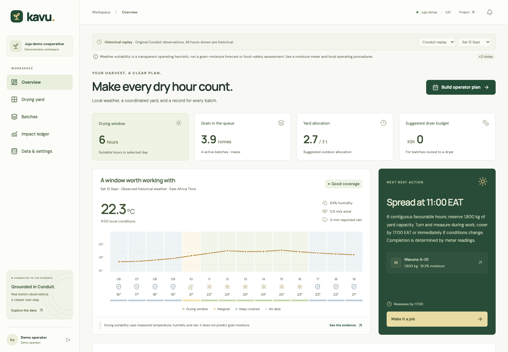
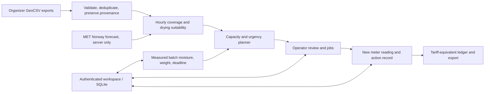

<div align="center">

# kavu.
### Every dry hour counts.

**The drying operations desk for maize cooperatives.**

[Explore the public demo](https://shi1720.github.io/Hack-The-Weather/) · [Pitch deck](output/kavu-pitch.pptx) · [Project brief](output/pdf/kavu-brief.pdf) · [Video script](docs/submission/video-script.md)

Built for **Hack the Weather 2026**, using real **JKUAT Conduit@Empathy** observations.

</div>



## The decision we solve

A cooperative has wet maize, limited outdoor drying space and a team to coordinate. Its manager must decide **which batch to spread, when to move it under shelter, and when to arrange a mechanical dryer**. A weather chart leaves those decisions and the follow-through to the manager.

Kavu connects station observations to a capacity-aware work plan. An operator records completed jobs and new moisture-meter readings. The resulting ledger shows what happened and a transparent drying-tariff equivalent.

**Data → decision → assigned work → measured moisture → an auditable cost record.**

The buyer is the cooperative or grain aggregation yard. One yard account can support the supervisor’s workflow without requiring every supplying farmer to buy an app. Customer adoption and willingness to pay are hypotheses for a pilot, not claimed traction.

## Try the complete journey

1. Open the [public demo](https://shi1720.github.io/Hack-The-Weather/) and select **Explore demo workspace**.
2. Keep **12 September 2026** selected. Conduit records yield a six-hour suitable window; the sample plan allocates **2,700 kg** within a **3,000 kg** yard.
3. Select **Build operator plan → Create operator jobs**. In the drying yard, confirm the spreading job for **Mavuno A-01**, then its turning job.
4. Open **Batches → Mavuno A-01 → Log reading**. Record an example **15.0%** moisture reading with a note that it is a demo measurement.
5. Open **Impact ledger**. For the 1,800 kg sample batch, the 18.2% → 15.0% change equals **KSh 2,176** after rounding under the reference tariff. It is labelled **tariff equivalent, not savings**.
6. Record **12.7%**, then confirm storage readiness. The system requires a recent measured reading at or below the batch target. This is an operational check, not a food-safety certificate.
7. Switch replay to **15 September**: the same weather rules find **zero** suitable drying hours. Switch to **8 September**: missing observations withhold an outdoor allocation. Kavu never turns a data gap into a sunny forecast.

The sample cooperative, farmers, batches and moisture readings are fictional and explicitly labelled. Station observations are real. The public demo stores changes on your browser/device; **it does not pretend to provide cloud accounts**. Server mode provides genuine authentication and private persistent workspaces.

## What works

| Capability | Implementation |
|---|---|
| Real accounts | Registration, sign-in, sign-out, password change, salted scrypt password hashes, expiring hashed sessions, secure production cookies |
| Private workspaces | SQLite persistence, authenticated ownership, atomic revision checks and conflict errors |
| Batch register | Intake weight/moisture/deadline, search, filters, measurement history, CSV export |
| Weather decisions | Auditable temperature/RH/VPD/rain rules, coverage gates, contiguous daylight windows, distance/freshness limits |
| Limited yard space | Whole-batch allocations by urgency and moisture, existing outdoor occupancy reserved until confirmed clearance |
| Operator jobs | Spread, turn, measure, move under shelter, dryer referral and storage review; explicit completion records |
| Shareable brief | English/Kiswahili operator text, copy-to-clipboard and print; no unrequested external messages |
| Verified progress | Meter readings drive moisture changes; clicking a drying task never invents moisture reduction |
| Evidence ledger | Recorded actions, measured changes, tariff-equivalent calculation, CSV export |
| Data provenance | Original GeoCSV, SHA-256 hashes, duplicate removal, real gaps and processing notes |
| Optional forecast | Server-side MET Norway Locationforecast, no paid key, bounded caching/timeouts and provider attribution |
| Responsive interface | Mobile navigation, keyboard-accessible forms/dialogs, locally hosted fonts, tested contrast; public sandbox caches for offline use after first successful load |

### Deliberate boundaries

Kavu is a working, tested application prepared for a **supervised pilot**, not a field-validated agronomic service. Its rules do not predict final grain moisture, aflatoxin, food safety, drying completion time, savings or emissions. No ML model has been trained and no model-accuracy claim is made. An explainable policy is more defensible than training on a short station record without labelled grain outcomes.

Historical replay uses observed weather retrospectively. It is not a hindcast, forecast backtest or evidence that the system could have predicted that weather. The optional forecast is a separate model source and is not calibrated by stale station observations. A real-account replay cannot execute historical spread/turn jobs as current operational instructions; the clearly labelled demonstration supports simulated completion.

**“Move under shelter” means physically clear the outdoor floor.** Merely putting a tarp over grain in place does not release yard capacity. Confirm the job only after the move. A dryer referral records an operator’s arrangement; it never claims that an external message was sent, a booking was made automatically or the grain actually entered a mechanical dryer.

## Meaningful use of Conduit data

We downloaded three original GeoCSV exports from the [organizer’s public data folder](https://drive.google.com/drive/folders/1KDoCh8vss7nv_B6SuVBlQQssjSh1yaBg). They identify **station 61: Kenya Kiambu JKUAT IOT AWS - Conduti@Empathy1**, at JKUAT in Juja.

| Evidence | Result |
|---|---:|
| Original data rows | 21,189 |
| Duplicate overlaps removed | 2,825 |
| Unique UTC observations | 18,364 |
| Invalid timestamp rows | 0 |
| Longest observed gap | 144.029 hours |
| 12 September replay | 6 favourable hours; 2,700 kg sample outdoor allocation |
| 15 September replay | 0 favourable hours; 0 kg outdoor allocation |
| 8 September gap / source removed | No outdoor allocation; unavailable evidence |

The last three comparisons hold the example batches, deadlines and planning date fixed, mapping each source day’s weather onto that planning date while preserving its EAT hour of day. This isolates the input-weather difference. They demonstrate **functional dependence on Conduit**, not a performance benchmark against field outcomes. Reproduce them with `npm run evaluate`; read the [evaluation report](docs/evaluation.md).

The parser preserves original timestamps and rejects malformed/non-finite input, de-duplicates overlaps and marks conflicts. The hourly pipeline uses SHT temperature, SHT relative humidity and primary rain-gauge observations. Missing rain remains unknown. The secondary rain gauge is excluded from decisions rather than silently substituted; radiation sensor counts are not treated as calibrated W/m². The export’s humidity unit label is inconsistent with the platform description, and that interpretation is documented.

All date/time display uses **Africa/Nairobi (UTC+3)**. Read [data methodology](docs/data-methodology.md), the [source manifest](data/README.md) and [quality report](data/processed/quality-report.json) for thresholds, source hashes, semantics and limitations.

## Commercial case

[NCPB publishes a drying reference tariff](https://ncpb.co.ke/drying/) of **KSh 377.80 per tonne per moisture percentage point**. Kavu uses the tonne-based value consistently. The same page’s rounded 50 kg bag quote does not produce exactly the same arithmetic.

```text
Tariff equivalent = weight in tonnes × remaining moisture percentage points × rate
Example: 5 tonnes × 2 percentage points × KSh 377.80 = KSh 3,778
```

This is a quoted-service equivalent, **not money saved**. Actual value needs invoices, labour, transport, handling, quality outcomes and a credible comparison. The rate is editable because real quotes change.

The starting commercial hypothesis is **KSh 2,500 per active month per yard**, with seasonal pricing to test. No per-decision LLM bill or new weather station is required for the demonstration. Deployment still has hosting, backup, support, calibration and adoption costs. The [market memo](docs/research/market-and-evidence.md) compares drying services, moisture sensors, agronomy platforms and spreadsheets, and models both high- and low-volume economics.

The defensible asset would be a consented dataset connecting local conditions, handling actions, measured batch outcomes and actual invoices. That dataset does not exist yet. The first pilot should observe existing work, run Kavu in shadow mode and only then evaluate supervised use. See the [pilot interview and measurement guide](docs/submission/pilot-interview-guide.md).

## Architecture



- **Frontend:** React 19, TypeScript, Vite, Lucide, original CSS, locally hosted DM Sans and Manrope.
- **Server:** Node.js 22+, Express 5, Helmet, rate limits and Zod input validation.
- **Persistence:** SQLite WAL mode via better-sqlite3; one persistent server process.
- **Decision engine:** pure TypeScript, shared by server and static demonstration; no language model needed.
- **Verification:** Vitest unit/integration tests, actual HTTP API tests, Playwright browser journeys and axe accessibility checks.

The public static demo and authenticated server use the same planner and workspace reducer. Authenticated authority always stays on the server. Each real account currently owns one yard; multi-operator invitations and organizations are future work.

## Run locally

Prerequisites: **Node.js 22.16+** and npm. No paid API keys are required.

```sh
git clone https://github.com/shi1720/Hack-The-Weather.git
cd Hack-The-Weather
npm ci
npm run dev
```

Open **http://127.0.0.1:5173**. The API runs at port 3001 and the UI proxies `/api` to it. Choose the isolated demo, or register a real account to start with an empty workspace. The local SQLite database is created under `var/` and is ignored by Git.

`.env.example` documents configuration; the server reads actual environment variables. To load a configured `.env` explicitly, use `node --env-file=.env --import tsx server/index.ts`. Do not put secrets in `VITE_` variables or commit local databases.

```sh
npm run build          # TypeScript + production UI build
npm test               # Deterministic data, planner, reducer, HTTP and forecast tests
npm run test:e2e        # Real browser journeys (npx playwright install chromium if needed)
npm run data:prepare   # Reproduce canonical observations and quality report
npm run evaluate       # Reproduce decision comparisons and JSON evidence
npm audit              # Dependency vulnerability check
```

### Deploy

The [deployment guide](docs/deployment.md) covers Docker/Compose, HTTPS, persistent volumes, trusted proxies, backups, session behaviour and limitations. The production server refuses a non-HTTPS public origin and uses secure cookies. Do not run its SQLite database on ephemeral serverless storage or scale multiple replicas against one file.

```sh
APP_ORIGIN=https://your-real-domain.example docker compose up --build -d
```

Replace that example origin with your own HTTPS hostname and configure a reverse proxy. The included GitHub workflow publishes the separate static demo. That demo is a judge-friendly sandbox, not a hosted production cooperative service.

Production customer rollout still requires an actual hosting account, TLS/domain setup, restore-tested backups, recovery/support/privacy procedures, data licensing confirmation and a supervised domain pilot. The repository does not claim those external operations have already happened.

## Submission materials

- [Editable pitch deck](output/kavu-pitch.pptx)
- [Four-page product/business brief](output/pdf/kavu-brief.pdf)
- [Verbatim 3–5 minute video script and shot list](docs/submission/video-script.md)
- [Actual 4:25 silent screen demonstration](output/kavu-demo-silent.mp4)
- [Recording instructions: add narration and real team appearances](docs/submission/recording-notes.md)
- [Ready-to-paste Devpost copy](docs/submission/devpost.md)
- [Judge Q&A / founder cheat sheet](docs/submission/judge-qa.md)
- [Human handoff checklist](docs/submission/human-handoff.md)
- [Internal judging review](docs/review/judge-review.md)

The video must include the actual eligible team members. A final voice/camera recording and public video URL are not fabricated or substituted by sample content.

## Team and AI disclosure

**Shivam Gupta — founder and product lead.** Shivam provided the problem-selection priorities, commercial requirements, product constraints and final review direction.

Codex assisted research, implementation, design, testing and submission materials. The product’s operational recommendations run on documented deterministic rules, not generative AI. Significant AI assistance is disclosed so the submission accurately represents how the work was developed. The team remains responsible for understanding, reviewing and explaining the implementation.

Additional human teammates must be added only after their participation and actual contributions are confirmed. An AI assistant is not a substitute for the event’s 2–5-person team requirement. The detailed rules and overview differ on eligibility wording and rubric weights; the handoff checklist records that conflict for final confirmation.

## Data sources, rights and licence

Conduit@Empathy / JKUAT / JHUB Africa, UCAR 3D-PAWS CHORDS, [station 61](https://3d-fewsnet.icdp.ucar.edu/instruments/61), DOI [10.5065/d6v1236q](https://doi.org/10.5065/d6v1236q); optional [MET Norway](https://api.met.no/doc/License); [NCPB tariff](https://ncpb.co.ke/drying/); [KALRO maize training manual](https://keep.kalro.org/appfiles/media/vc_files/maize-tot.pdf).

Original Kavu code and documentation: [MIT](LICENSE). Data, fonts and other third-party resources retain their own rights; see [THIRD_PARTY.md](THIRD_PARTY.md). No source affiliation, partnership, field validation or endorsement is implied.
